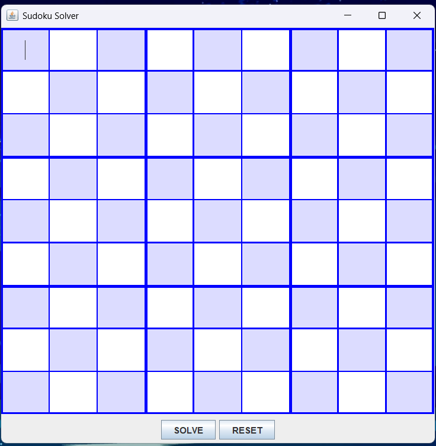
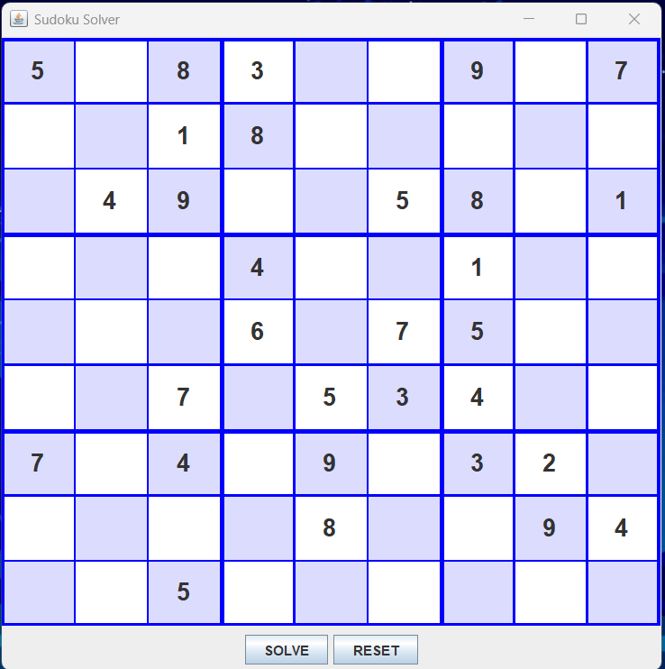
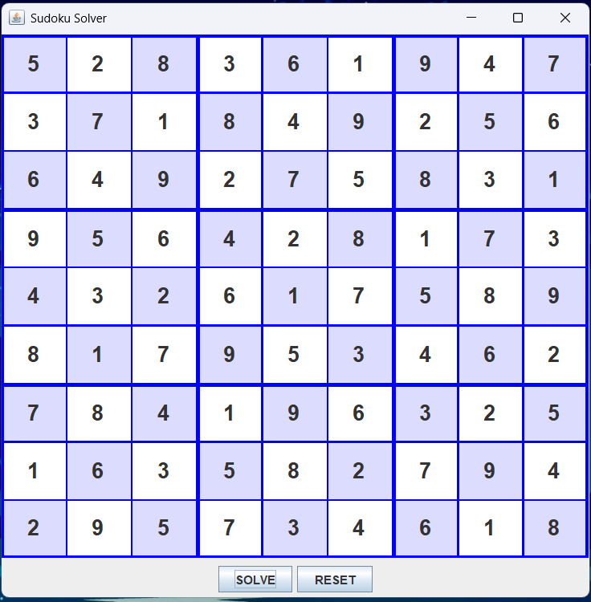

# Java-Sudoku-Solver

A desktop-based Sudoku Solver application developed using Java Swing and Backtracking Algorithm.

## Features

- Interactive 9x9 Sudoku Grid
- Solve Sudoku using Backtracking
- Reset Button to clear the board
- Input Validation
- Detects Invalid Sudoku Inputs
- User-Friendly GUI using Java Swing
- Colored Grid UI for Better Visualization

## Technologies Used

- Java
- Java Swing
- Backtracking Algorithm
- Recursion

## How It Works

The project uses a backtracking algorithm to solve Sudoku puzzles.

1. Empty cells are identified.
2. Numbers from 1 to 9 are tried.
3. Validity is checked for:
   - Row
   - Column
   - 3x3 Box
4. If a number leads to a dead end, the algorithm backtracks and tries another number.

## Screenshots

### Main Interface

### Sudoku

### Solved Sudoku

